*작성자: 이민우*<br>
*작성일: 20210330*<br>
*문서 목적 : 인프라 (REDMINE) 인수인계*<br>
----
#### REDMINE 설치

1. Jupyter HUB 접속 <br>
2. oc login 을 통한 okd 클러스터 접속 <br>
3. 코드 내려받기 <br>
```
git clone https://gitlab.com/aibigdata/helmcharts.git
```
4. 레드마인을 배포할 네임스페이스 생성 후 현재 네임스페이스 변경 
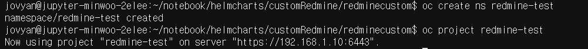

5. scc 제한 해제 (**sh 파일에서 Namespace 명이나 serviceAccount 명 확인**) <br>
oc adm  policy add-scc-to-user $권한명 system:serviceaccount:$네임스페이스명:$서비스어카운트명<br>
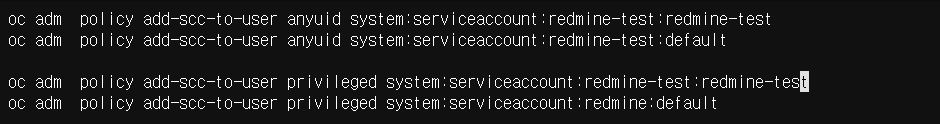

serviceaccount 명은 value 파일에서 관리<br>
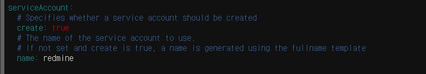


ex)scc.sh

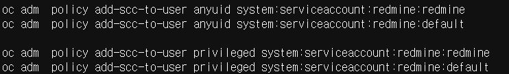

6. PV 생성 <br>
- PV name 이나 라벨 중첩되지 않게 변경 <br>
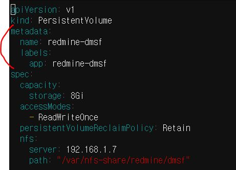

```
oc create -f redmine-pv.yaml
oc create -f redmine-board-pv.yaml
```

7. pvc 에서 PV 명 매핑 및 pvc 명도 유니크하게 구성 
PV 라벨값과 매핑 <br>
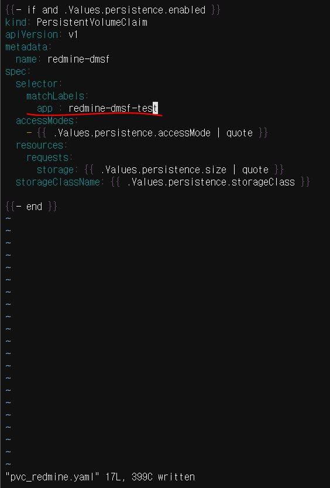

8. Deployment 에 pvc 명 메핑
template/deployment.yaml 하단에 pvc 명 매핑 
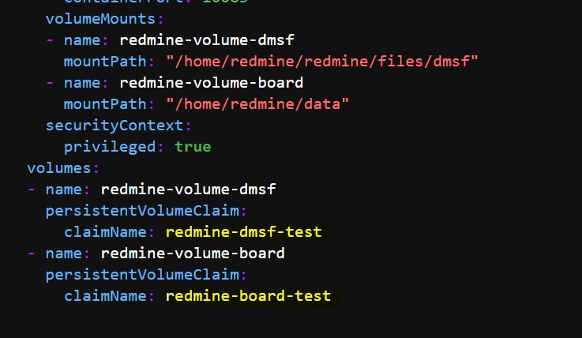

8. nfs-server 에 디렉토리 생성 <br>
경로는 PV Yaml 에서 관리 <br>
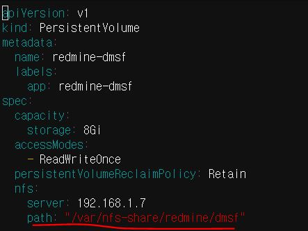
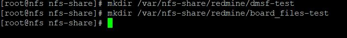

**SSH 접속하여 디렉터리 생성** <br>
    접속 IP :192.168.1.7 <br>
    ID : root<br>
    password : !!aibig$$2020<br>

9. Value 파일에서 DB 관련 정보 세팅 <br>
현재 운영 DB(postgre)의 redmine 을 사용중 <br>
연결할 Postgre에서 DB 생성 후 관련 정보를 기입 <br>
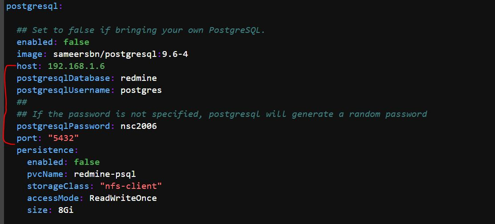

10. 레드마인 배포 <br>
helm upgrade --install $helm배포이름 customRedmine/ --values $value파일경로 -n $네임스페이스명

```
helm upgrade --install redmine-test redminecustom/ --values redminecustom/values.yaml -n redmine-test
```

okd 접속 후 배포한 프로젝트에 접속하여 생성된 POD 확인 러닝상태이면 정상배포
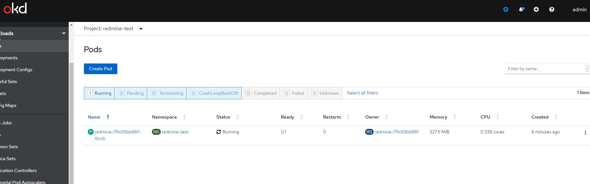

10. 라우트 생성 <br>
네트워킹 탭에 routes 접속 후 이름 및 host 기입 , 연결할 서비스 및 port 설정 후 생성 
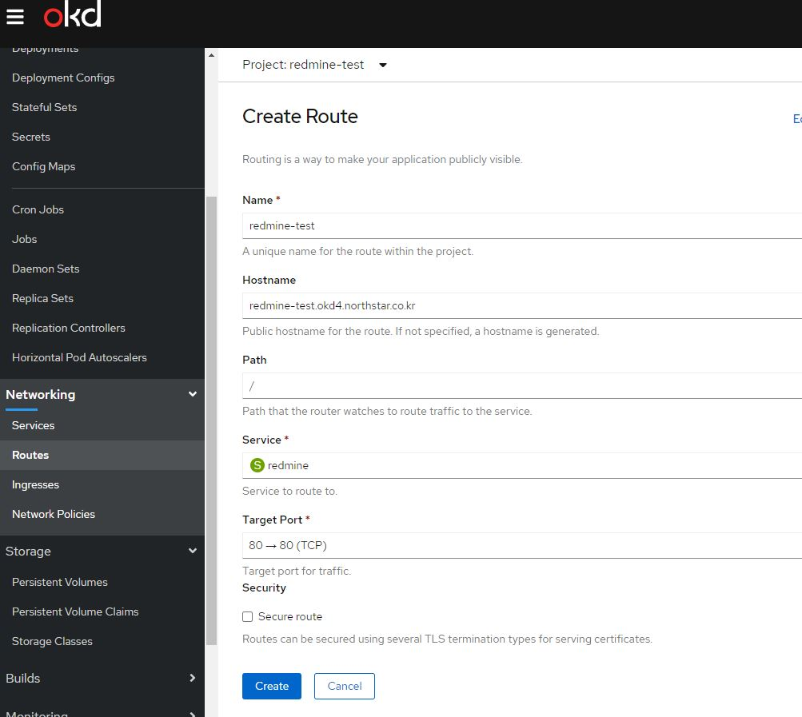

생성한 route 에 접속하여 레드마인 실행 

---


#### 참고자료
쿠버네티스 scc : <https://kubernetes.io/ko/docs/concepts/policy/pod-security-policy/> <br>
openshift scc 듀토리얼 : <http://wiki.rockplace.co.kr/display/OP/01.+Service+Accounts+and+SCC>
