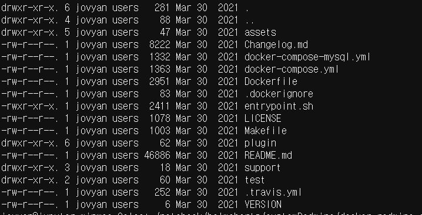
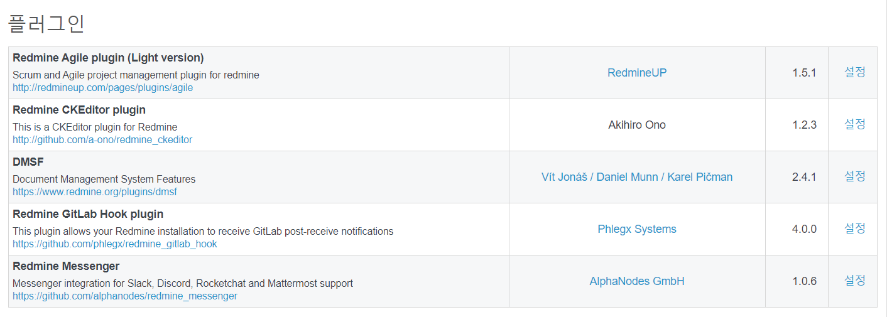

*작성자: 이민우*<br>
*작성일: 20210330*<br>
*문서 목적 : 인프라 (REDMINE) 인수인계*<br>

----

#### 도커 파일 경로  
```
git clone https://gitlab.com/aibigdata/helmcharts.git
cd customRedmine/docker-redmine-custom
```

*구성 파일*



- 현 repo의 docker-redmine 디렉토리는 semeerin님이 만드신 redmine 이미지에 5개의 plugin과 theme를 추가해 둔 Dockerfile
-  *docker-redmine-custom/plugin 의 plugins 디렉토리에 가서 압축파일 해제*

customRedmine/docker-redmine-custom/Dockerfile
```
FROM ubuntu:xenial-20190222 AS add-apt-repositories

RUN apt-get update \
 && DEBIAN_FRONTEND=noninteractive apt-get install -y wget \
 && apt-key adv --keyserver keyserver.ubuntu.com --recv E1DD270288B4E6030699E45FA1715D88E1DF1F24 \
 && echo "deb http://ppa.launchpad.net/git-core/ppa/ubuntu xenial main" >> /etc/apt/sources.list \
 && apt-key adv --keyserver keyserver.ubuntu.com --recv 80F70E11F0F0D5F10CB20E62F5DA5F09C3173AA6 \
 && echo "deb http://ppa.launchpad.net/brightbox/ruby-ng/ubuntu xenial main" >> /etc/apt/sources.list \
 && apt-key adv --keyserver keyserver.ubuntu.com --recv 8B3981E7A6852F782CC4951600A6F0A3C300EE8C \
 && echo "deb http://ppa.launchpad.net/nginx/stable/ubuntu xenial main" >> /etc/apt/sources.list \
 && wget --quiet -O - https://www.postgresql.org/media/keys/ACCC4CF8.asc | apt-key add - \
 && echo 'deb http://apt.postgresql.org/pub/repos/apt/ xenial-pgdg main' > /etc/apt/sources.list.d/pgdg.list

FROM ubuntu:xenial-20190222

LABEL maintainer="sameer@damagehead.com"

ENV RUBY_VERSION=2.4 \
    REDMINE_VERSION=4.0.6 \
    REDMINE_USER="redmine" \
    REDMINE_HOME="/home/redmine" \
    REDMINE_LOG_DIR="/var/log/redmine" \
    REDMINE_ASSETS_DIR="/etc/docker-redmine" \
    RAILS_ENV=production

ENV REDMINE_INSTALL_DIR="${REDMINE_HOME}/redmine" \
    REDMINE_DATA_DIR="${REDMINE_HOME}/data" \
    REDMINE_BUILD_ASSETS_DIR="${REDMINE_ASSETS_DIR}/build" \
    REDMINE_RUNTIME_ASSETS_DIR="${REDMINE_ASSETS_DIR}/runtime"

COPY --from=add-apt-repositories /etc/apt/trusted.gpg /etc/apt/trusted.gpg

COPY --from=add-apt-repositories /etc/apt/sources.list /etc/apt/sources.list
COPY --from=add-apt-repositories /etc/apt/sources.list.d/pgdg.list /etc/apt/sources.list.d/

RUN apt-get update \
 && DEBIAN_FRONTEND=noninteractive apt-get install --no-install-recommends -y \
      supervisor logrotate nginx mysql-client postgresql-client ca-certificates sudo tzdata \
      imagemagick subversion git cvs bzr mercurial darcs rsync ruby${RUBY_VERSION} locales openssh-client \
      gcc g++ make patch pkg-config gettext-base ruby${RUBY_VERSION}-dev libc6-dev zlib1g-dev libxml2-dev \
      libmysqlclient20 libpq5 libyaml-0-2 libcurl3 libssl1.0.0 uuid-dev xz-utils \
      libxslt1.1 libffi6 zlib1g gsfonts vim-tiny \
 && update-locale LANG=C.UTF-8 LC_MESSAGES=POSIX \
 && gem install --no-document bundler \
 && rm -rf /var/lib/apt/lists/*

COPY assets/build/ ${REDMINE_BUILD_ASSETS_DIR}/

RUN bash ${REDMINE_BUILD_ASSETS_DIR}/install.sh

COPY assets/runtime/ ${REDMINE_RUNTIME_ASSETS_DIR}/

COPY assets/tools/ /usr/bin/

############### 기존 원본 도커파일에서 추가 된 부분 
RUN mkdir ${REDMINE_DATA_DIR}

RUN mkdir ${REDMINE_HOME}/temp

### 플러그인 이동 
COPY plugin/. ${REDMINE_HOME}/temp/ 
##############
COPY entrypoint.sh /sbin/entrypoint.sh

RUN chmod 755 /sbin/entrypoint.sh \
 && sed -i '/session    required     pam_loginuid.so/c\#session    required   pam_loginuid.so' /etc/pam.d/cron

EXPOSE 80/tcp 443/tcp

WORKDIR ${REDMINE_INSTALL_DIR}

ENTRYPOINT ["/sbin/entrypoint.sh"]

CMD ["app:start"]

```

customRedmine/docker-redmine-custom/entrypoint.sh
```
#!/bin/bash
set -e
source ${REDMINE_RUNTIME_ASSETS_DIR}/functions

[[ $DEBUG == true ]] && set -x

case ${1} in
  app:init|app:start|app:rake|app:backup:create|app:backup:restore)

    initialize_system
    configure_redmine
    configure_nginx

    case ${1} in ########### 플러그인 설치 부분 redmine을 구성한 unicorn 의 설정 때문에 하나씩 설치 
      app:start)
        version_check
        migrate_database
        cp ${REDMINE_HOME}/temp/plugins/redmine_agile ${REDMINE_DATA_DIR}/plugins -r
        install_plugins
        sleep 5
        cp ${REDMINE_HOME}/temp/plugins/redmine_ckeditor ${REDMINE_DATA_DIR}/plugins -r
        install_plugins
        sleep 5
        cp ${REDMINE_HOME}/temp/plugins/redmine_dmsf ${REDMINE_DATA_DIR}/plugins -r
        install_plugins
        sleep 5
        cp ${REDMINE_HOME}/temp/plugins/redmine_messenger ${REDMINE_DATA_DIR}/plugins -r
    install_plugins
        sleep 5
    cp ${REDMINE_HOME}/temp/plugins/redmine_gitlab_hook ${REDMINE_DATA_DIR}/plugins -r
    install_plugins
        sleep 5
        cp ${REDMINE_HOME}/temp/plugins/redmine_gitlab_hook ${REDMINE_DATA_DIR}/plugins -r 
    sleep 5
        
        cp ${REDMINE_HOME}/temp/themes/circle ${REDMINE_DATA_DIR}/themes -r
    install_themes

        if [[ -f ${REDMINE_DATA_DIR}/entrypoint.custom.sh ]]; then
          echo "Executing entrypoint.custom.sh..."
          . ${REDMINE_DATA_DIR}/entrypoint.custom.sh
        fi

        rm -rf /var/run/supervisor.sock
        exec /usr/bin/supervisord -nc /etc/supervisor/supervisord.conf
        ;;
      app:init)
        version_check
        migrate_database
        install_plugins
        install_themes
        ;;
      app:rake)
        shift 1
        execute_raketask $@
        ;;
      app:backup:create)
        shift 1
        backup_create $@
        ;;
      app:backup:restore)
        shift 1
        backup_restore $@
        ;;
    esac
    ;;
  app:help)
    echo "Available options:"
    echo " app:start          - Starts the Redmine server (default)"
    echo " app:init           - Initialize the Redmine server (e.g. create databases, install plugins/themes), but don't start it."
    echo " app:rake <task>    - Execute a rake task."
    echo " app:backup:create  - Create a backup."
    echo " app:backup:restore - Restore an existing backup."
    echo " app:help           - Displays the help"
    echo " [command]          - Execute the specified command, eg. bash."
    ;;
  *)
    exec "$@"
    ;;
esac

```


***플러그인을 추가 설치하고 싶다면***
1. 현재 레드마인과 호환성을 고려 (4.0.6) <br>
2. plugin 디렉토리 내에 압축 해제해서 디렉토리 형태로 첨부 <br>
3. entrypoint 에 plugin 설치 커맨드 기입 


**현재 설치된 플러그인**



**플러그인 출처**

redmine agile : <https://www.redmine.org/plugins/redmine_agile>
<br>
redmine ckeditor : <https://www.redmine.org/plugins/redmine-ckeditor>
<br>
redmine dmsf : <https://www.redmine.org/plugins/redmine_dmsf>
<br>
redmine gitlab hook : <https://github.com/phlegx/redmine_gitlab_hook>
<br>
redmine messenger : <https://www.redmine.org/plugins/redmine_messenger>


---

원본 출처 : <https://hub.docker.com/r/sameersbn/redmine>
