### Redmine - gitlab 연동

----

*redmine_gitlab_hook 플러그인 사용*

*플러그인 셋업 가정*

**gitlab 연동은 원하는 git-repo 와 프로젝트를 연동하는 것으로 commit이 이루어질때
해당하는 commit이 어떤 일감과 연동되어있느지 확인하기 용이하다.**

-----

1. 프로젝트 생성

**프로젝트 생성할 때 식별자가 연동할때 프로젝트를 구분하는데 쓰이게 된다.**
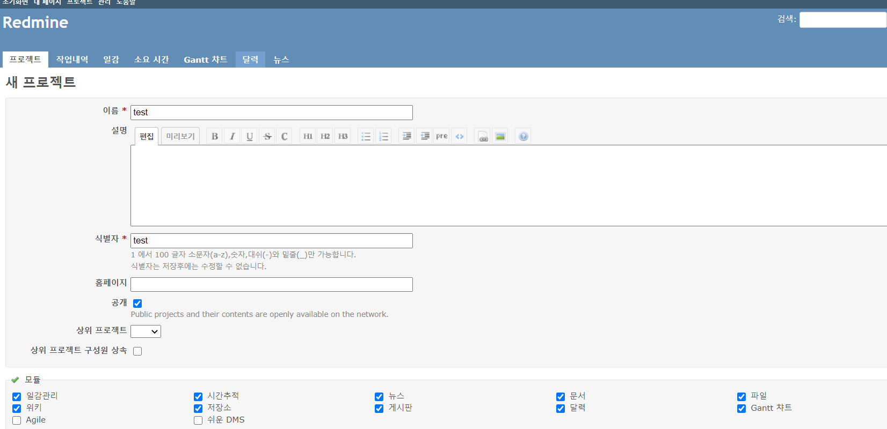


2. apikey 생성

**관리 -> 설정 -> 저장소 에 온 후 git을 선택한다. 그 후 저장소 관리에 WS 사용을 체크한 다음 api 키 생성을 진행한다. 차후 gitlab에 사용된다.**
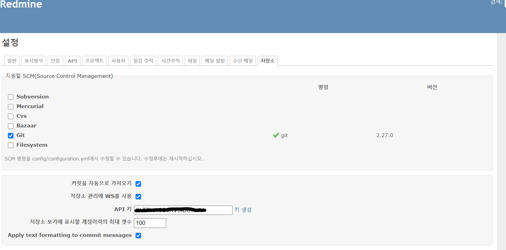

3. Local repostiory 생성

**이미지에 같이 git이 생성되어 있지 않다면 직접 pod 에 접속에 clone 해줘야한다. mirror 옵션과 인증을 하기위한 계정 정보 또한 같이 명시한다. clone 받는 경로가 곧 local repo 가 된다. 아래 방법말고 토큰을 받거나 global config로 인증을 진행해주어도 무방하다.**

```git clone --mirror http://<username>:<password>@gitlab.com/minwoo-lee/gitlab-test.git```

4. Local repository 설정

**관리 -> 플러그인 -> Redmine GitLab Hook plugin 에 들어와 Local path를 맞춰준다. 우리의 경우는 pod 내에 git이 clone 된 경로이다**

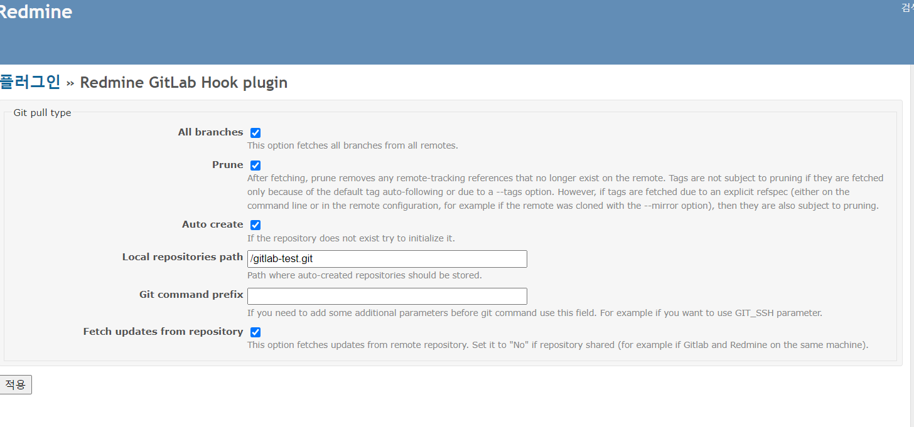

5. 프로젝트와 Local repository 연동

**프로젝트 -> 설정  -> 저장소 에 들어와 저장소를 생성한다. 식별자의 경우 (gitlab-namespace)_(git-repo) 로 작성해야한다. 네임스페이스는 보통 유저 네임으로 이뤄지기 때문에 _ 기호가 들어가면 안된다. 저장소 경로는 로컬 위치로 지정한다.**
    

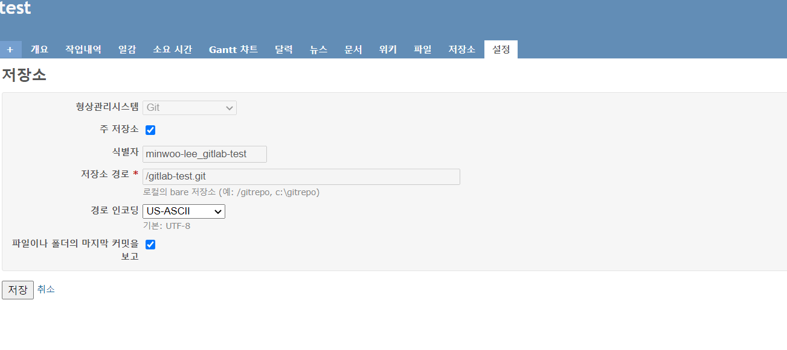

**정상 등록이 된다면 저장소 탭을 누른다면 아래와 같이 repo 내용이 보인다.**
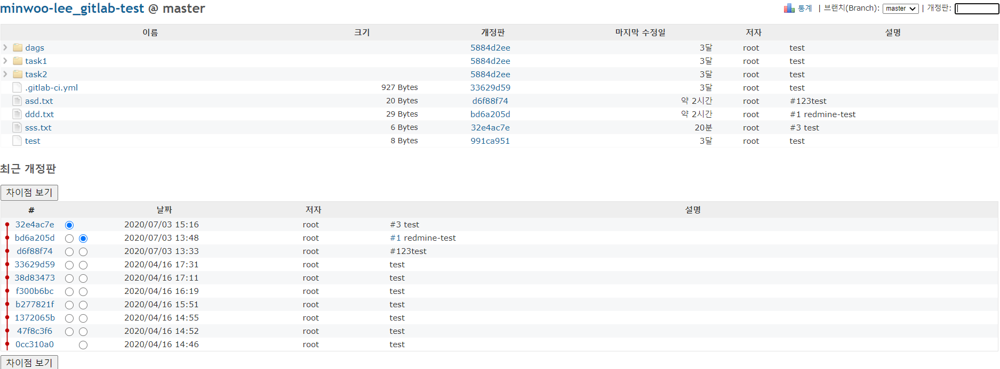


6. gitlab에 들어와 Setting-> webhook 에 들어와 작성한다.

**아래 example 을 참고하여 같은 형식으로 작성한다. **
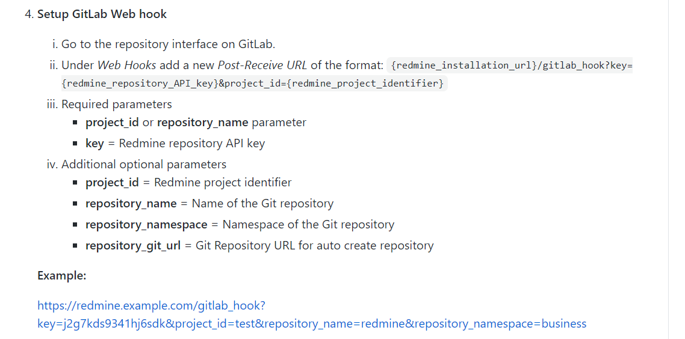

**현재 가이드에선 아래와 같이 작성하였다.**

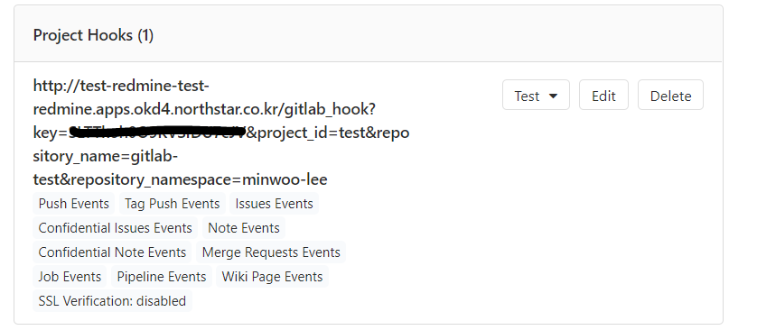

7. 완료 테스트
**text 를 눌러 아래와 같은 결과가 출력되면 정상 연동 된 것이다**

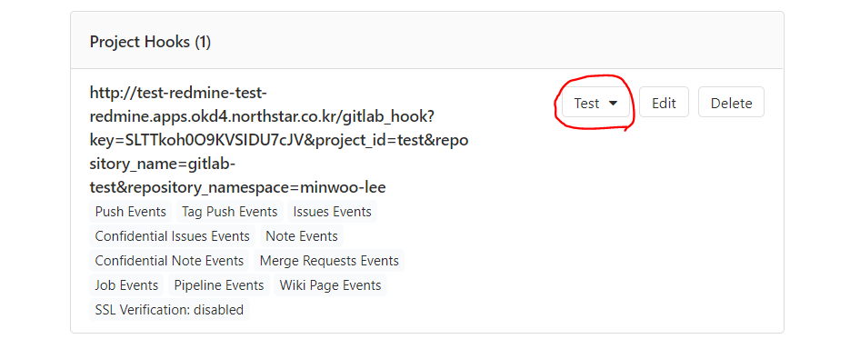
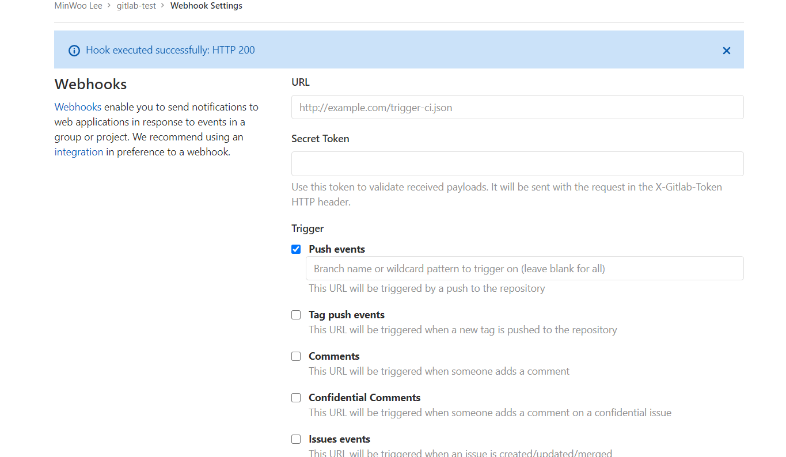

-------

### 일감과 연동

**프로젝트에 일감을 등록하게 되면 아래와 같이 tag가 붙는다**
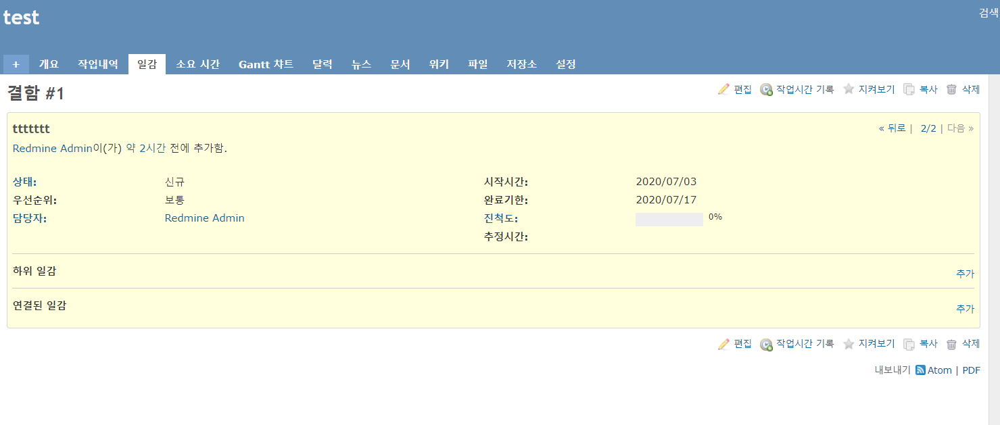

**커밋을 일감 태그를 앞에 붙여 하게되면 자동으로 일감과 연동된다.**

ex)```git commit -m '#1 redmine-test```

**아래 표시한 곳을 누르면 연동된 일감 페이지로 이동된다.**
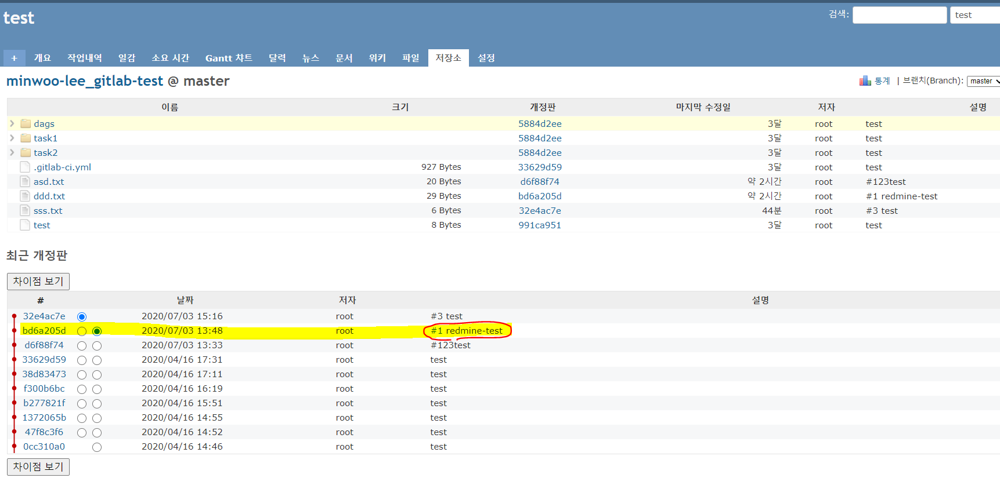


-----

#### 참고자료

[redmine_gitlab_hook 플러그인](https://github.com/phlegx/redmine_gitlab_hook)